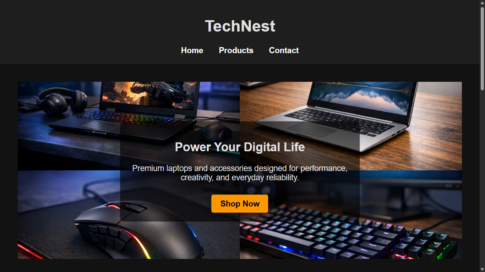

# E-Commerce Website (HTML & CSS)

## Project Overview
TechNest is a static e-commerce website designed for browsing and purchasing laptops online.
It showcases a clean layout with intuitive navigation, product listings, and a responsive design for different screen sizes.
The website focuses on presenting laptop specifications, pricing, and contact information in a simple and user-friendly interface.
Built using HTML and CSS, it demonstrates core web design concepts without JavaScript.

## Website Pages
- Home 
- products
- Contacts

## Technologies Used
- HTML5
- CSS3
- GitHub Pages

## Live Website

https://tirthsoni927.github.io/TechNest-/

## Screenshots

## Author
Tirth Soni - CST0400 - 2025/26

